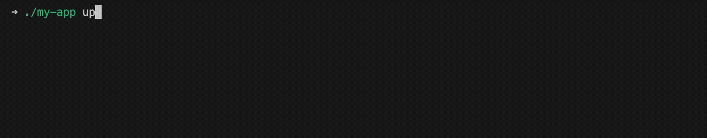

# 

Self-executable CDK apps.



Ever tried to quickly demo some infrastructure code? You write your CDK app, then switch to the terminal for `cdk deploy`, then back again for `cdk destroy`. It's annoying. Sharing examples is even worse - people need the CDK CLI installed and configured just to try your code. CDK up/down fixes this by making your apps self-executable. Your code becomes the deployment tool. One command to deploy and clean up. Perfect for quick prototyping, live demos, and tutorials where you don't want setup friction getting in the way.

## Installation

Install the package using your preferred package manager:

```console
npm install @mrgrain/cdk-updown
yarn add @mrgrain/cdk-updown
pnpm add @mrgrain/cdk-updown
bun add @mrgrain/cdk-updown
```

## Usage

Create an executable TypeScript file for your CDK app `./bin/my-app.ts` using the `updown()` function.

```typescript
import { updown } from "@mrgrain/cdk-updown";
import { App, Stack, aws_sns } from "aws-cdk-lib";

const cli = updown(async () => {
  // Build your CDK app here
  const app = new App();
  const stack = new Stack(app);
  new aws_sns.Topic(stack, "Topic");

  return app.synth();
});

// Run the CLI
await cli.run();
```

Then execute as usual:

```console
npx tsx ./bin/my-app.ts
```

## Single-file executable

Using a bundle that can produce single-file executables, it is easily possible to make your CDK app fully runtime independent.
For example [with Bun](https://bun.sh/docs/bundler/executables):

```console
bun build ./bin/my-app.ts --compile --minify --outfile ./dist/my-app
```

Now you have a fully self-contained binary of your app:

```console
./dist/my-app
```

## Advanced Use Cases

You can also call `up()` and `down()` directly.
This gives you more control when to deploy or destroy your infrastructure without relying on command-line arguments.
Will also skip the selection dialog.

```typescript
import { updown } from "@mrgrain/cdk-updown";
import { App, Stack, aws_sns } from "aws-cdk-lib";

declare const builder: AssemblyBuilder;

const cli = updown(builder);

// Up only
await cli.up();

// Down only
await cli.down();
```
