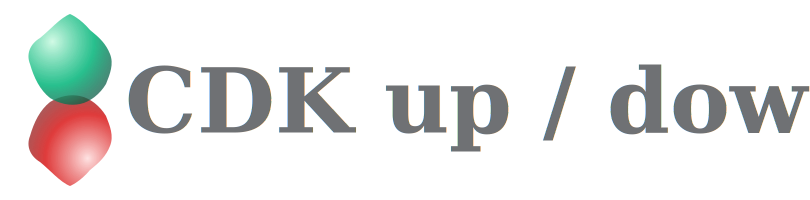
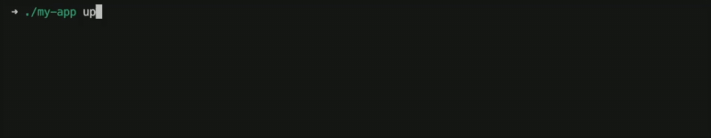

# 

Self-executable CDK apps.



## Installation

Install the package using your preferred package manager:

```console
npm install @mrgrain/cdk-updown
yarn add @mrgrain/cdk-updown
pnpm add @mrgrain/cdk-updown
bun add @mrgrain/cdk-updown
```

## Usage

Create an executable TypeScript file for your CDK app `./bin/my-app.ts` using the `updown()` function.

```typescript
import { updown } from "@mrgrain/cdk-updown";
import { App, Stack, aws_sns } from "aws-cdk-lib";

const cli = updown(async () => {
  // Build your CDK app here
  const app = new App();
  const stack = new Stack(app);
  new aws_sns.Topic(stack, "Topic");

  return app.synth();
});

// Run the CLI
await cli.run();
```

Then execute as usual:

```console
npx tsx ./bin/my-app.ts
```

## Single-file executable

Using a bundle that can produce single-file executables, it is easily possible to make your CDK app fully runtime independent.
For example [with Bun](https://bun.sh/docs/bundler/executables):

```console
bun build ./bin/my-app.ts --compile --minify --outfile ./dist/my-app
```

Now you have a fully self-contained binary of your app:

```console
./dist/my-app
```

## Advanced Use Cases

You can also call `up()` and `down()` directly.
It gives you more control over when to deploy or destroy your infrastructure without relying on command-line arguments.

Both methods return deployment data and throw errors instead of exiting the process.
They skip the selection dialog, but maintain the terminal output.
You can use them to build a more customized CLI experience.

```typescript
import { updown } from "@mrgrain/cdk-updown";
import { App, Stack, aws_sns } from "aws-cdk-lib";

declare const builder: AssemblyBuilder;

try {
  // Create the updown cli
  const cli = updown(builder);

  // Up and get deployment result
  const deployResult = await cli.up();
  console.log(`Deployed ${deployResult.stacks.length} stacks`);
  
  // Down and get destroy result
  const destroyResult = await cli.down();
  console.log(`Destroyed ${destroyResult.stacks.length} stacks`);

} catch (error) {
  console.error('Operation failed:', error.message);
  // Handle error as needed
}
```
